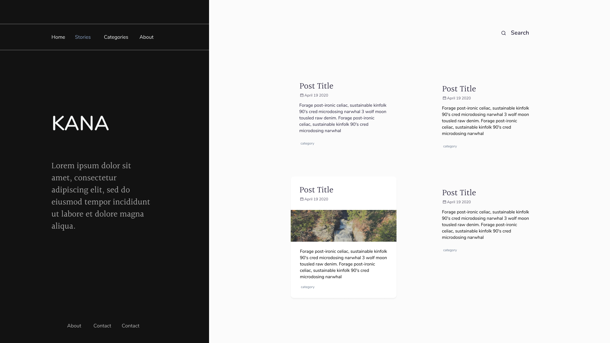
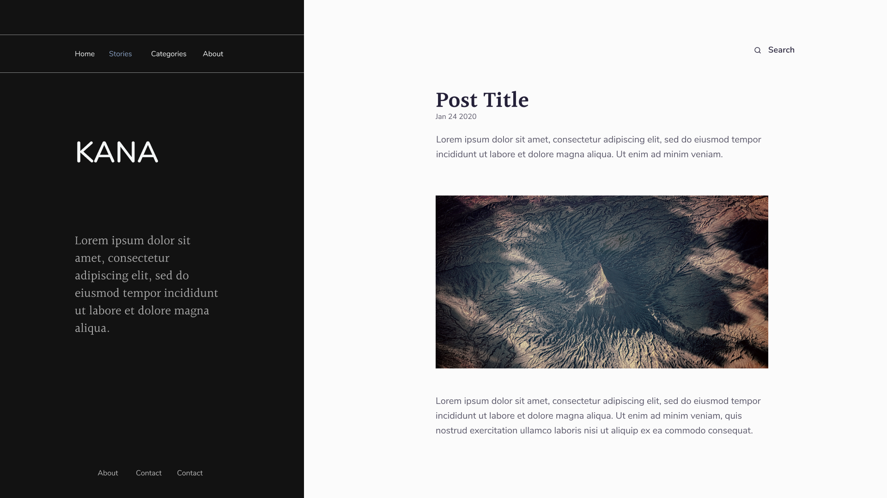

# Kana

A tailwind css based theme for gatsby

## WiP

there is still work needed on this theme its around ~50% completed

### Configuration

```js
module.exports = {
  siteMetadata: {
    title: 'Kana',
    description: 'This description is used for SEO purposes and sidebar',
    social: [
      {
        site: 'twitter',
        url: 'https://twitter.com/dpineda64',
      },
      {
        site: 'github',
        url: 'https://github.com/dpineda64',
      },
    ],
    titleTemplate: '%s @ Site Test',
    url: 'https://themes.dpineda.dev/gatsby/kana',
    image: '/images/kana.jpg',
  },
  plugins: [
    {
      resolve: 'gatsby=theme-kana',
      options: {
        contentPath: 'posts', // where your md files are
        basePath: '/posts', // where this theme would be leave
        nav: [
          // an array of objects with [text, path] for the top navigation in the sidebar
          {
            text: 'Home',
            path: '/',
          },
        ],
      },
    },
  ],
};
```

## Screenshots (from Figma)

### Post List



### Single Post


